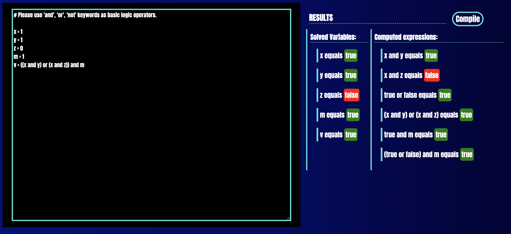

# Logical Notebook

## Description
The **Logical Notebook** is a practical and efficient tool for solving complex Boolean algebra expressions. It is designed to deliver not only the final results of computations but also to provide a clear view of the intermediate steps involved. This feature-rich calculator is a valuable asset for students, educators, and professionals who regularly engage with Boolean algebra.

### Key Features:

- **In-depth Calculation:** This calculator handles a diverse array of Boolean algebra expressions with precision and accuracy, making it a versatile tool for various applications.

- **Step-by-Step Analysis:** It sets itself apart by displaying the intermediate steps in solving Boolean expressions. This functionality is crucial for educational purposes, assisting in demystifying the logic behind each calculation.

- **Clear Variable Values Display:** At the end of each calculation, the calculator presents the final values of the variables within the Boolean expression, ensuring users gain a comprehensive understanding of the outcomes.

- **User-Centric Design:** The interface is straightforward, facilitating easy input of expressions and quick acquisition of results, which caters to both beginners and experienced users.

### Applications:

- **Educational Utility:** An excellent resource for educational settings, the calculator aids students in learning Boolean algebra by showing the calculation process in a step-by-step manner.

- **Professional Tool:** It's also a reliable assistant for professionals in technical fields like computer science and electrical engineering, where Boolean algebra is a fundamental concept.

